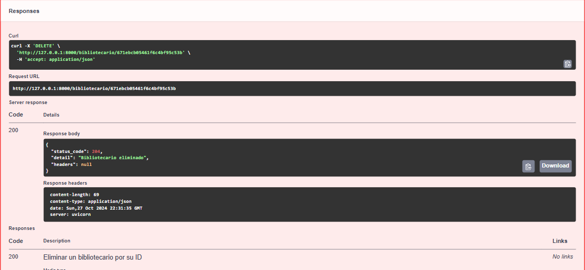

### Base de datos
Para el desarrollo de este proyectp se utilizo MongoDB Atlas es un servicio de base de datos en la nube desarrollado por 
MongoDB, Inc., diseñado para simplificar la administración de bases de datos MongoDB, 
proporcionando una infraestructura confiable, segura y completamente administrada en 
plataformas de nube como AWS, Google Cloud y Azure.

### Ejecucion en Docker
Para ejecutar el contenedor del proyecto es necesario pasarle las variables de entorno 
del par de claves de aws para que el proyecto funcione correctamente, por lo que el 
comando debe de ser el siguiente:`docker run -e AWS_ACCESS_KEY_ID=your_access_key_id -e 
AWS_SECRET_ACCESS_KEY=your_secret_access_key -p 80:80 sd-proyecto1` donde your_acces_key_id 
y your_secret_access_key son tus claves de aws.

### Ejecucion en Visual Studio Code
Para la ejecucion desde vsc al abrir el proyecto, en la terminal ejecutar el siguiente comando:
`uv run fastapi dev`:

Una vez ejecutado el comando, la terminal nos mostrará un link para ingresar a la interfaz
de usuario para realizar los métodos de HTTP (Protocolo de Transferencia de Hipertexto):

Una vez dentro del sistema realizaremos el GET, POST, PUT Y DELETE, de la entidad bibliotecario
para ejemplificar la función del sistema. 
En el caso del método get se necesitará ingresar un cuerpo de la forma 
`{
  "nombre": "String"
  "apellido": "String"
  "correo". "String"
}`, como en el ejemplo de la siguiente imagen:

Al ejecutar la petición y llenar los campos de la forma correcta nos mandará como respuesta 
los datos que ingresamos en el body:

Al ejecutarse la petición, los datos se guardarán en la base de datos:

Al ingresar varios datos podremos visualizarlos todos con el método GET

En caso de haber ingresado algun dato de manera incorrecta através del metodo PUT podremos
actualizar algun dato, sin embargo necesitaremos un `id`, el cual es asignado por la base
de datos, este `id` debe ser ingresado en el cuerpo de la petición, asi como el body con 
la siguiente estructura `{
  "nombre": "String"
  "apellido": "String"
  "correo". "String"
}`

Una vez actualizados los datos, la petición nos mostrará una respuesta similar al 
método POST

La actualización tambien se visualizará atraves de la base de datos

Por ultimo tenemos el método GETBYID y DELETE, los cuales solo necesitarán en su cuerpo el
`id` del bibliotecario que queremos eliminar, cuando hagamos la petición del getbyid necesitaremos
ingresar el `id` y al ejecutar la petición arroja los datos correspondientes al `id` ingresado
##### Cuerpo:

##### Respuesta:

En el caso del DELETE nos mostrará como respuesta que el dato ha sido eliminado

Dato que a su vez tambien se eliminará de la base de datos

 
Estas funciones son similares para las entidades de autor y lector, solo cambiando los
datos que se ingresarán en el body:
##### POST de la entidad autor:

##### POST de la entidad lector:

 
En el caso de las entidades de prestamo y libro el cuerpo tendrá una forma diferente 
de ingresar los datos, ya que se ingresarán en forma de formulario teniendo además un
apartado para hacer la carga de una imagen desde la computadora:
##### POST de la entidad libro:

##### POST de la entidad prestamo:

Al hacer el ingreso de los datos através de este método, la imagen aparacera como una 
URL que apunta a la ubicación de una imagen de la credencial del lector. La URL 
apunta a un archivo alojado en Amazon S3
##### Datos de prestamo en la base de datos:

##### Datos de libro en la base de datos:

Las imagenes cargadas desde la api se almacenaran en un bucket llamado 
"proyecto1-upiiz-bucketsaws-s3" en la carpeta "Credenciales"

